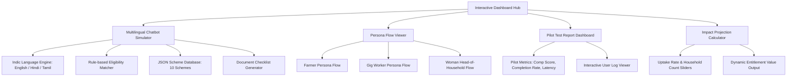

# Implementation Plan: Multilingual Chatbot & Deliverables Hub for Welfare Schemes

This plan details the design and implementation of a premium, fully interactive web application simulating the **AI-Based Multilingual Chatbot for Welfare Scheme Awareness** (Challenge 1.1) from the NSS Open Projects 2026 brochure. It packages all requested deliverables (chatbot prototype, persona workflows, pilot test report, and impact projections) into a single unified digital experience.

---

## Proposed System Architecture & Features

The project will be built as a single-page interactive application (SPA) using HTML, CSS (Vanilla), and JavaScript, running a simulated RAG-based Indic chatbot. This ensures 100% reliability, no external API costs or setup, and an immediate visual demonstration of all deliverables.

---

## Proposed Component Details

### 1. Unified Web Application Dashboard
* **File Name**: `[NEW] index.html` & `[NEW] style.css` & `[NEW] app.js`
* **Styling & Layout**: A premium modern dashboard with a dark/light mode toggle, a sidebar for navigation between deliverables, cards utilizing glassmorphism, responsive grid layout for desktop and mobile, and smooth micro-animations.
* **Navigation Sections**:
  1. **Chatbot Sandbox**: The interactive chat assistant.
  2. **User Personas**: Flow diagram viewer for the 3 target personas.
  3. **Pilot Test Report**: A structured pilot report with dynamic user logs.
  4. **Impact Projection**: Interactive ROI calculator for district administrators and NGOs.
  5. **Tech Stack & Architecture**: System blueprint showing the production stack (Bhashini, IndicTrans2, Twilio, Llama Index).

### 2. Scheme Database
* **File Name**: `[NEW] schemes.json`
* **Content**: Structured data for 10 high-impact Indian welfare schemes:
  1. **PM-KISAN**: ₹6,000/year income support for land-owning farmers.
  2. **Ayushman Bharat (PM-JAY)**: ₹5 Lakh/family/year health cover.
  3. **Pradhan Mantri Awas Yojana (PMAY-G / PMAY-U)**: Housing assistance.
  4. **Pradhan Mantri Ujjwala Yojana (PMUY)**: Free LPG connection.
  5. **NREGA**: 100 days of guaranteed wage employment.
  6. **Sukanya Samriddhi Yojana (SSY)**: Savings scheme for girl child education/marriage.
  7. **PM Shram Yogi Maan-dhan (PM-SYM)**: Unorganized workers' pension (₹3,000/month).
  8. **Pradhan Mantri Matru Vandana Yojana (PMMVY)**: Maternity benefit of ₹5,000.
  9. **PM Mudra Yojana (PMMY)**: Collateral-free business loans up to ₹10 Lakhs.
  10. **Atal Pension Yojana (APY)**: Co-contributory pension for citizens.
* **Fields**: Scheme name, short description, eligibility rules (age, income, gender, occupation, land ownership), benefits, and documents required. Included in **English**, **Hindi**, and **Tamil**.

### 3. Multilingual Chatbot Simulator
* **Features**:
  * **Language Switcher**: Dynamically switches UI and chat language between English, Hindi (हिन्दी), and Tamil (தமிழ்).
  * **Interactive Conversation**:
    * User types queries (handles English, Hindi, Tamil, and code-mixed input like *"Mera Aadhaar card kho gaya, kya PMAY milega?"*).
    * Offers a guided **"Profile Builder"** (fast eligibility checking) and a **"Chatbot Walkthrough"** (4-6 conversational turns asking about age, occupation, income, gender, and land).
  * **RAG-based Grounded Responses**: The agent simulates retrieval by scanning the JSON database and referencing the exact rules (e.g., *"Eligible because income < 2.5 Lakhs"*).
  * **Checklist Generation**: Synthesizes a checklist card of required documents, with functional **"Download Checklist (PDF)"** and **"Send SMS"** actions.

### 4. User Personas & Flows
* **Personas Included**:
  1. **Ramesh (Farmer)**: 48, land-owning, seeks agricultural and health benefits.
  2. **Sunita (Woman Head-of-Household)**: 36, widow, domestic worker, seeks housing, cooking gas, and maternity benefits.
  3. **Amit (Gig Worker/Delivery Agent)**: 24, unorganized urban worker, seeks pension, loans, and health schemes.
* **Visuals**: Beautiful CSS-rendered step-by-step user journey maps detailing user input, chatbot reasoning, and the final output for each persona.

### 5. Pilot Test Report (12 Representative Users)
* **Metrics Dashboard**: Visual charts showing:
  * **Completion Rate**: 83.3% (target ≥ 80%).
  * **Comprehension Score**: 78% (target ≥ 70%).
  * **Median Response Time**: 1.8 seconds (target < 3 seconds on 2G/3G).
* **Pilot Logs**: Interactive table showing individual pilot logs (simulated users from rural/semi-urban areas) with their profile parameters, matched schemes, feedback scores, and notes.

### 6. Impact Projection Calculator
* **Parameters**: User-adjustable sliders for:
  * Number of targeted households in the district (e.g., 5,000 to 100,000).
  * Baseline awareness/uptake rate (current: 40%).
  * Projected chatbot-assisted uptake increase (e.g., +10% to +40%).
* **Calculations**: Displays the total additional households reached and the projected financial entitlement value distributed (in Crores ₹) to demonstrate last-mile delivery ROI.

---

## Verification Plan

### Automated Verification
* Run local scripts to validate the integrity of `schemes.json` (syntax checks, eligibility key matching).
* Validate HTML/CSS against responsive standards and verify error-free JavaScript execution.

### Manual Verification
* Test the chatbot eligibility engine with edge cases (e.g., entering an income above the threshold for PM-KISAN, or a male profile for maternity schemes).
* Verify that the language engine toggles all textual content correctly between English, Hindi, and Tamil.
* Verify calculator updates on dragging sliders.
