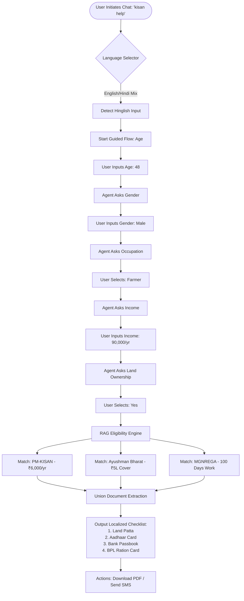
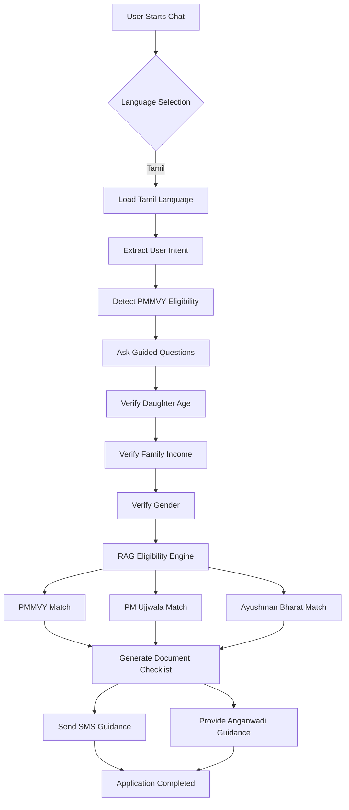
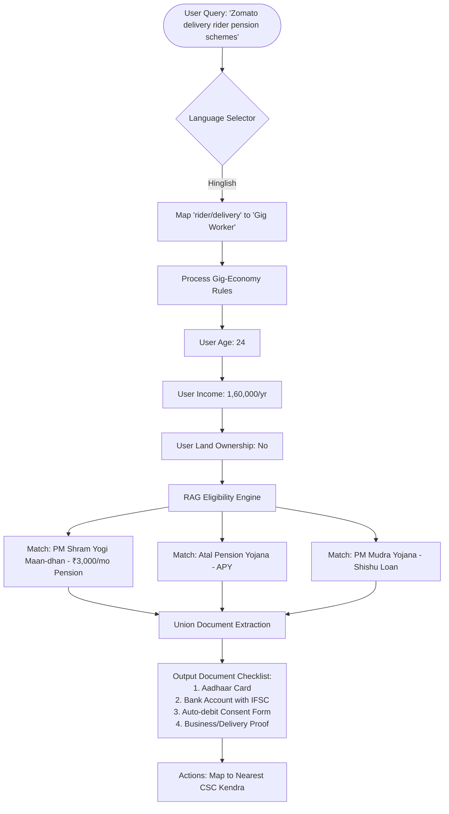

# Deliverable 1: User-Flow Persona Diagrams

This document contains the user profiles and conversational logic mappings for the three representative target personas of **JanSeva AI**.

---

## Persona 1: Ramesh Prasad (Farmer)
* **Background**: 48-year-old traditional farmer in a village near Patna, Bihar. Owns 1.5 acres of agricultural land.
* **Tech Literacy**: Uses a basic Android smartphone, primarily for voice messages. Struggles with text-heavy English/Hindi government portals.
* **Goals**: Secure agricultural subsidies and health insurance cover for his household.

---

## Persona 2: Sunita Devi (Woman Head-of-Household)
* **Background**: 36-year-old widow and domestic helper in suburban Coimbatore, Tamil Nadu. Sole breadwinner for three children, including a pregnant 19-year-old daughter.
* **Tech Literacy**: Basic smartphone user, uses WhatsApp for family calls. Fluent only in spoken Tamil.
* **Goals**: Secure clean cooking gas and financial maternity benefits for her daughter.

    
   

---

## Persona 3: Amit Kumar (Gig Worker)
* **Background**: 24-year-old food delivery rider in Outer Delhi. High-school graduate.
* **Tech Literacy**: Comfortable using smartphones and apps, but has no employer health coverage or social security.
* **Goals**: Secure a loan to buy a delivery motorcycle and establish a retirement savings fund.

